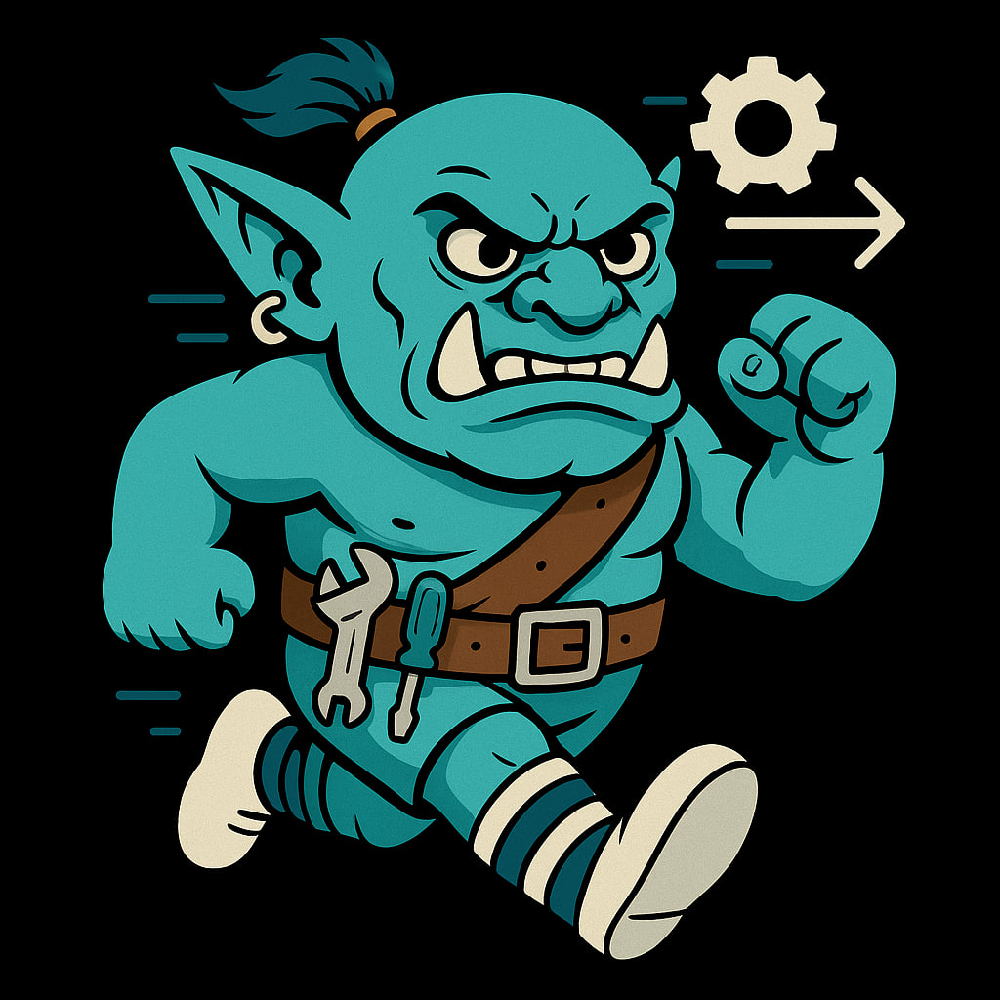

# Cube / Orc



A DIY orchestrator for educational purposes based on the book [Build an Orchestrator in Go (From Scratch)](https://www.manning.com/books/build-an-orchestrator-in-go-from-scratch)

Rewritten for Golang v1.24

# Installation

```bash
git clone git@github.com:humangrass/orc.git
cd orc
go mod download
```

# Usage

### Running the orchestrator

```bash
go run cmd/orc/main.go
```

### Example Output

```text
starting task
Collecting stats
{"status":"Pulling from strm/helloworld-http","id":"latest"}
{"status":"Digest: sha256:bd44b0ca80c26b5eba984bf498a9c3bab0eb1c59d30d8df3cb2c073937ee4e45"}
{"status":"Status: Image is up to date for strm/helloworld-http:latest"}
task 372fc8a6-17a3-407b-aa48-fdf32fa641a5 is running in container 04fd59c1619ed66625bece7aa4fd52bd4205bd52233a362835d1cd249c9b8f68
Sleepy time!
stopping task 372fc8a6-17a3-407b-aa48-fdf32fa641a5
2025/04/13 11:53:27 Attempting to stop container 04fd59c1619ed66625bece7aa4fd52bd4205bd52233a362835d1cd249c9b8f68
2025/04/13 11:53:36 Stopped and removed container 04fd59c1619ed66625bece7aa4fd52bd4205bd52233a362835d1cd249c9b8f68 for task 372fc8a6-17a3-407b-aa48-fdf32fa641a5
```
